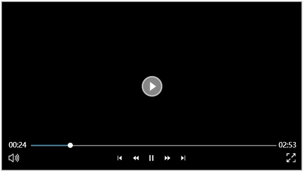
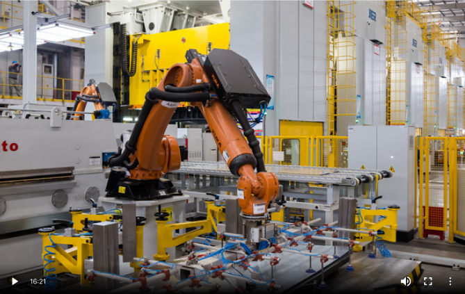
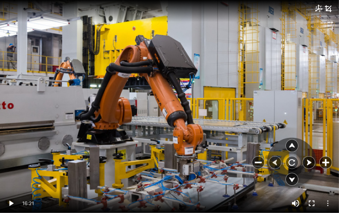

# Camera

Used to display the video of the cameras configured in the **"Devices" -> "Camera"** list.

**Properties**

| **Name**        | **Description**     |
|-----------------|--------------|
| Name            | The name of this control. |
| X               | The distance between the left side of the control and the left side of the canvas.         |
| Y               | The distance between the top of the control and the top of the canvas.     |
| W               | The width of the control.    |
| H               | The height of the control.      |
| Camera          | Select a Camera device for the control. This Camera  is created on the **"Devices"->"Camera"** page and supports dynamic binding.    |
| Enable PTZ      | When enabled, hovering the mouse over the control will display the PTZ (Pan-Tilt-Zoom) control panel. Ensure the bound camera has its Onvif service correctly configured.  It allows you to control the camera to rotate in the set direction, with one click resulting in one rotation.      camera rotates upward    camera rotates down    Camera turns right    Camera turns left    Reset the camera     Zoom in    Zoom out  |----------------------------------------------------------|     
| Enable Snapshot | When enabled, hovering the mouse over the control will display the screenshot button.       Click the button to save the current frame as an image.        |                                  |
| View Coordinate | When enabled, hovering the mouse over the control will display the coordinate view button.       Click the button to display the current coordinates of the camera.              |---------------------------------------------------------------------------------------------------------------------------------------------|--------------------------------------------------------------------|                                                                                                                                                                                                                                                                                                                                                                                          |

**Event**

Allows you to perform specific events based on certain conditions. See the full description of each event on the [Event](../../event/index.md)  page.

**Example**

View the real-time production status of workshop 1.

1. On the **"Devices"->"Camera"** page, create a new video name. See the [Camera](./../../../management-platform/devices/camera/index.md)  for details .
2. Insert a "Camera" control on the page.
3. Set the camera for the control and select: **Streamer1/Workshop 1**.
4. Click the run button on the page to view the video.
5. Move the mouse over the control to display the operation buttons.

|                      |                                                                   |
|----------------------|-------------------------------------------------------------------|
|  | play button                                                       |
|  | pause button                                                      |
|  | Sound settings button                                             |
|  | full screen button                                                |
|  | Picture-in-picture button, click to start picture-in-picture mode |

#### Autoplay policy

When a page link is opened directly, the video will not autoplay because the browser considers that there has been no interaction between the user and the domain  (click, tap, etc.). The user will need to manually click the play button.

In the following situations, browser allow autoplay with sound:

- The user has interacted with the domain (click, tap, etc.)；
- On desktop, the user's Media Engagement Index threshold has been crossed, meaning the user has previously played video with sound.
- The user has added the site to their home screen on mobile or installed the PWA on desktop.

For more details, please refer to the official website:  [https://developer.chrome.com/blog/autoplay?hl=zh-cn](https://developer.chrome.com/blog/autoplay?hl=zh-cn)