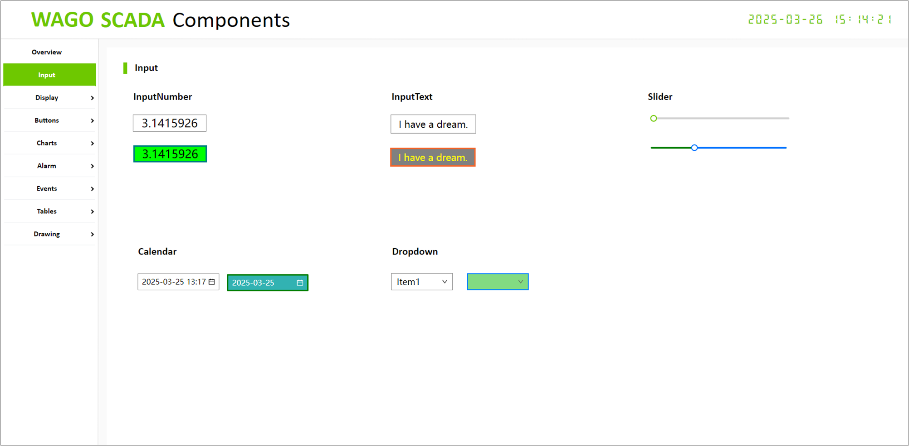
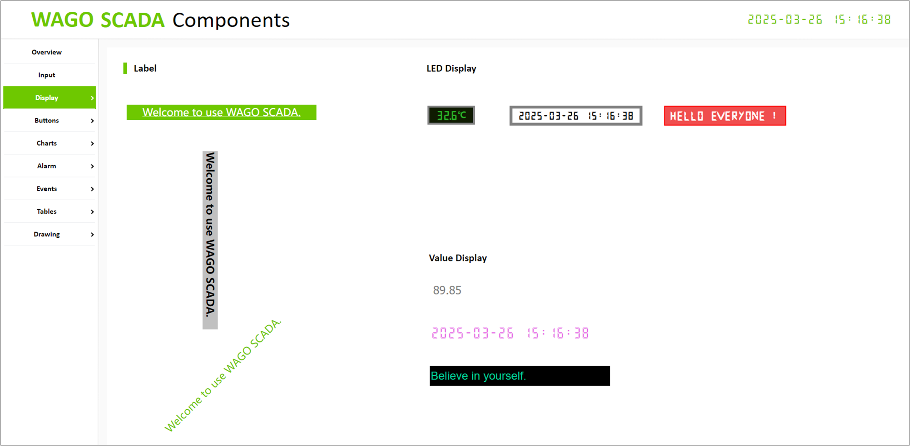
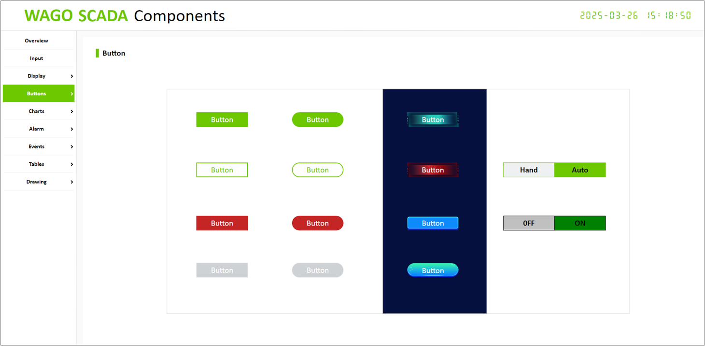
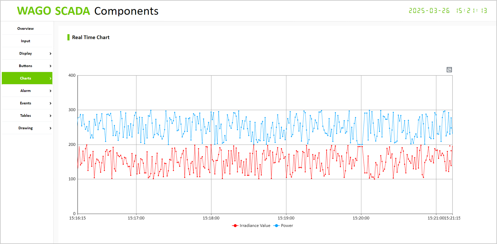
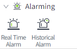
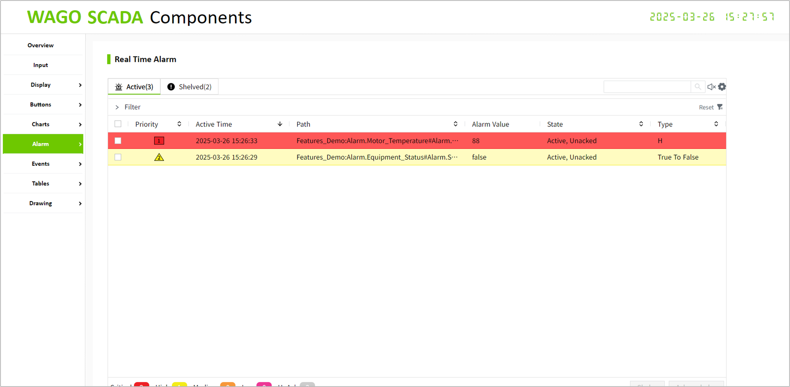
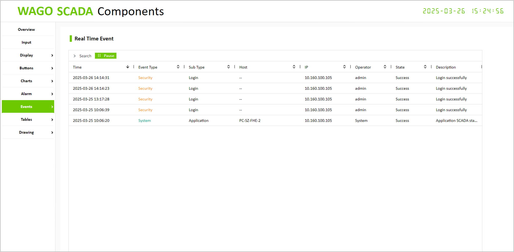
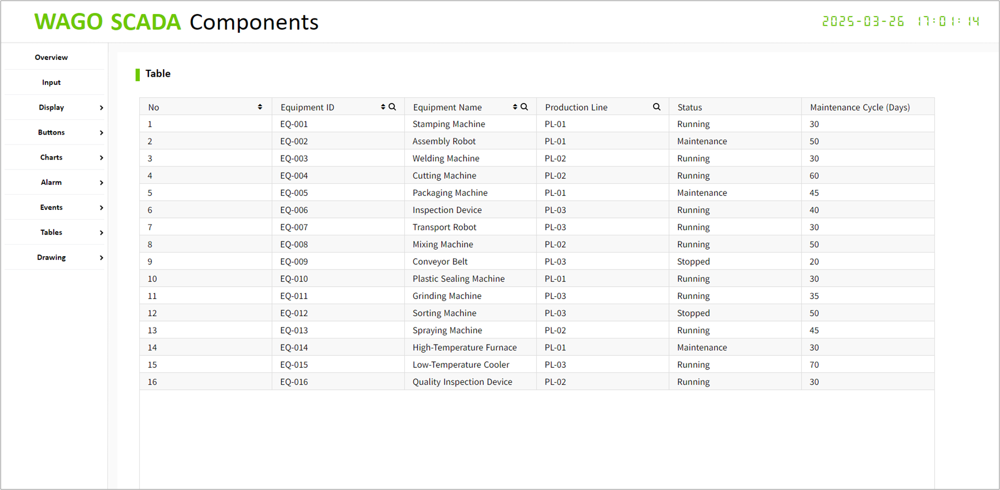
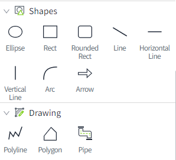
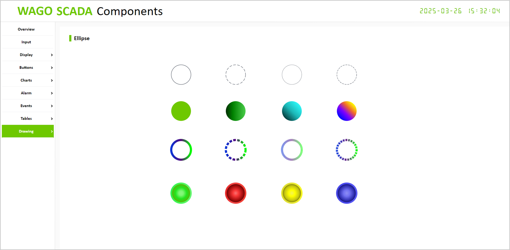

# Components

Description: This project is used to display the various control effects of WAGO SCADA.

1. Input

     

     

2. Display

     

     

3. Buttons

     

     

4. Charts

     

     

5. Alarm

     

     

6. Events

     

     
7. Tables

     

     

8. Drawing
     

     

