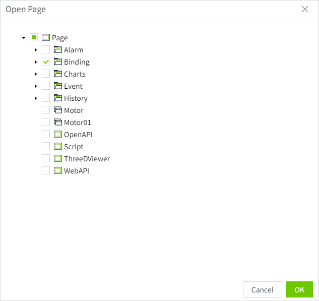
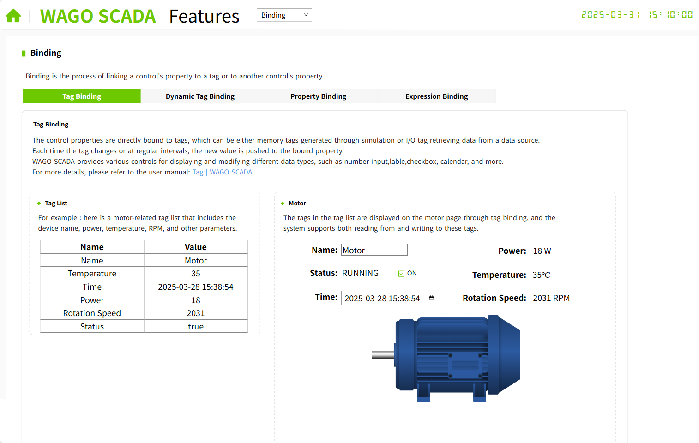
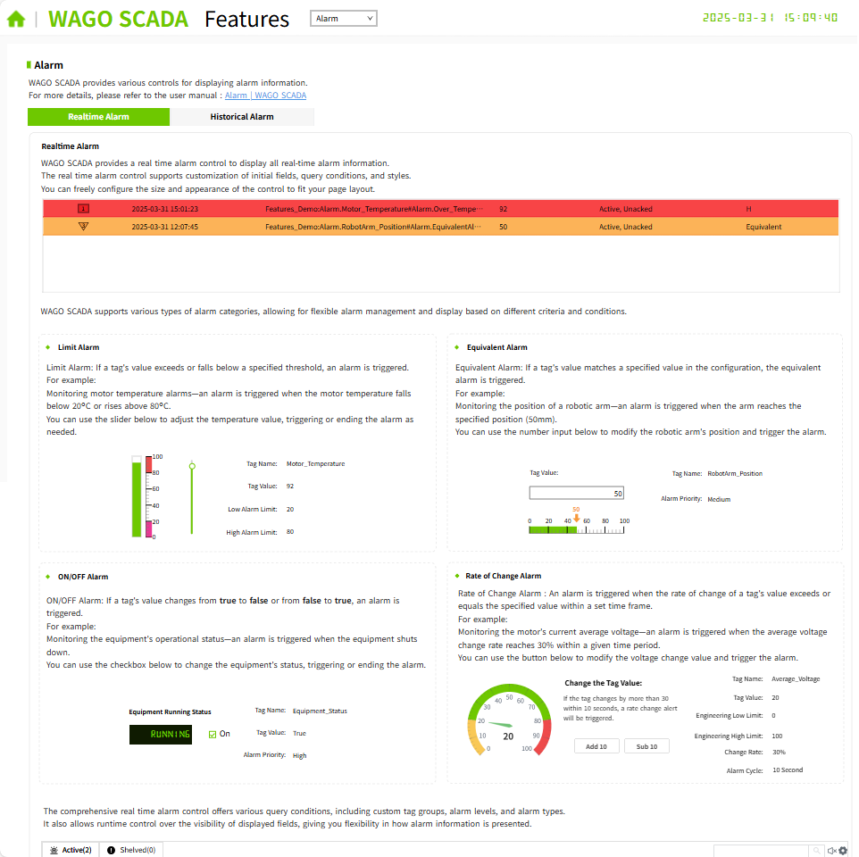
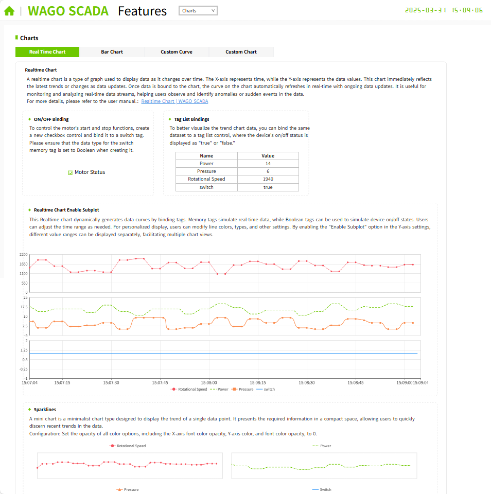
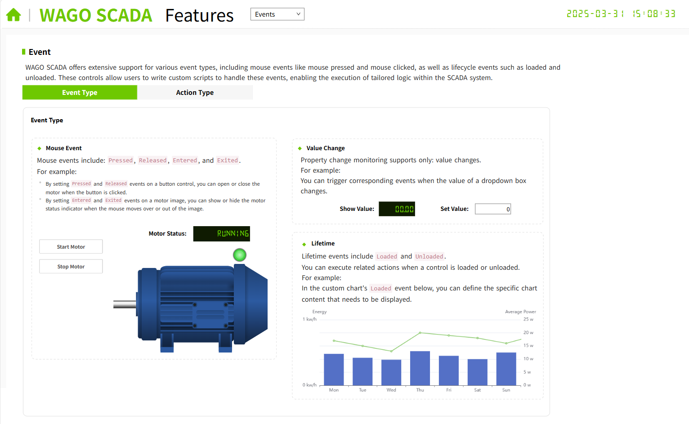
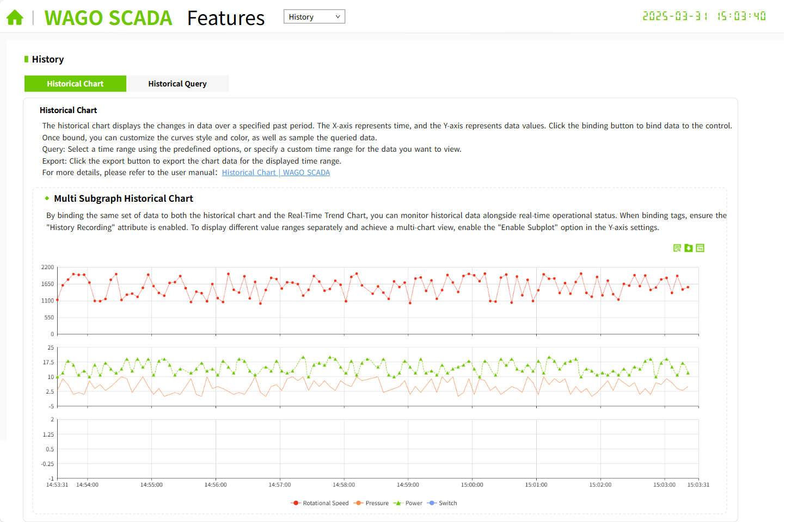
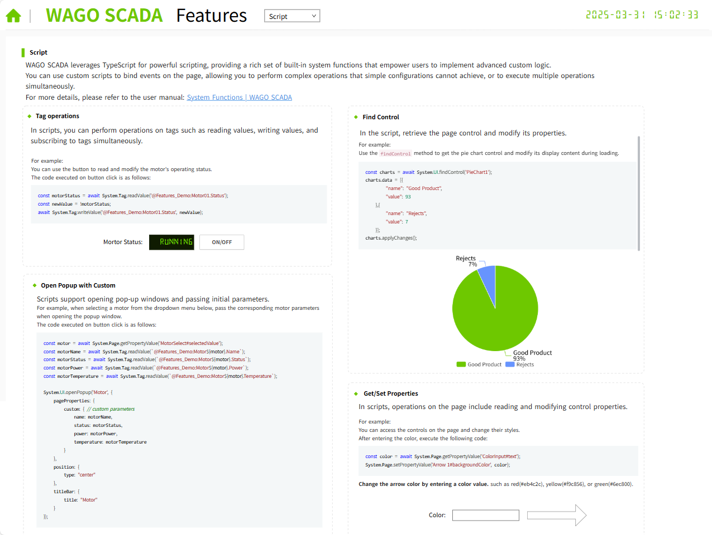
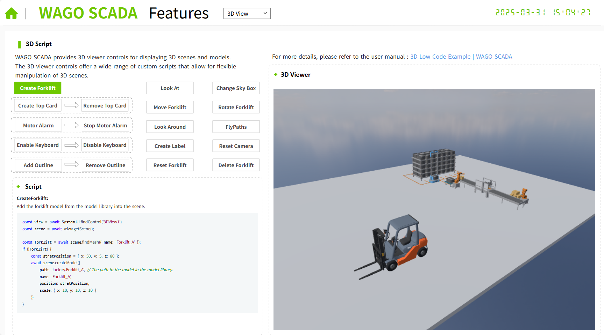
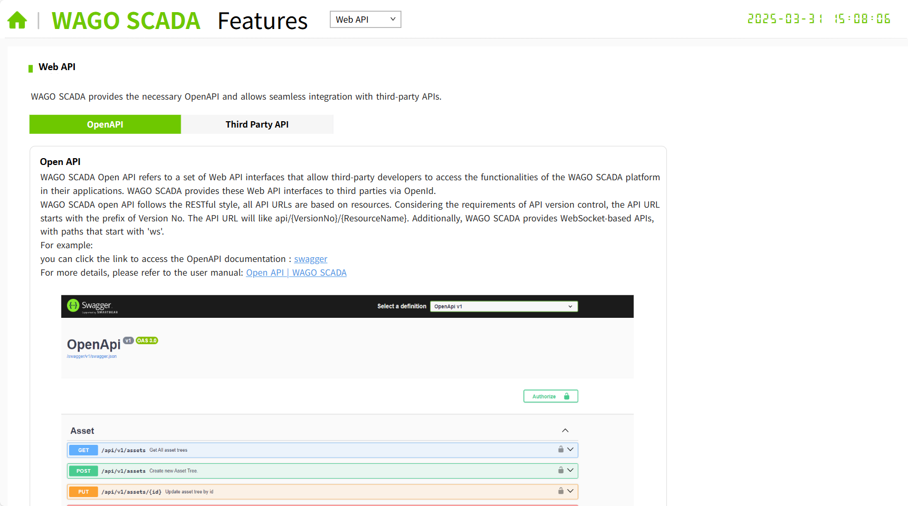

# Features

**Description:** This project is used to introduce various core features of WAGO SCADA.

You can click the "Design" button in this project and then click "Open Page" in the editor to view each screen.

#### Binding

Introduction to the Four Types of Property Binding in WAGO SCADA. On the Home project's running page, click the "Binding" icon to display this page.

#### Alarm

Introduction to the Alarm Function in WAGO SCADA. On the Home project's running page, click the "Alarm" icon to display this page.

#### Charts

Introduction to the Charts in WAGO SCADA. On the Home project's running page, click the "Charts" icon to display this page.

#### Events

Introduction to the Events in WAGO SCADA. On the Home project's running page, click the "Events" icon to display this page.

#### History

Introduction to the History Data Function in WAGO SCADA. On the Home project's running page, click the "History" icon to display this page.

#### Script

Introduction to the Script Function in WAGO SCADA. On the Home project's runtime page, click the "Script" icon to display this page.

#### 3D View

Introduction to the 3D Function in WAGO SCADA. On the Home project's runtime page, click the "3D View" icon to display this page.

#### Web API

Introduction to the Web API Function in WAGO SCADA. On the Home project's runtime page, click the "Web API" icon to display this page.

