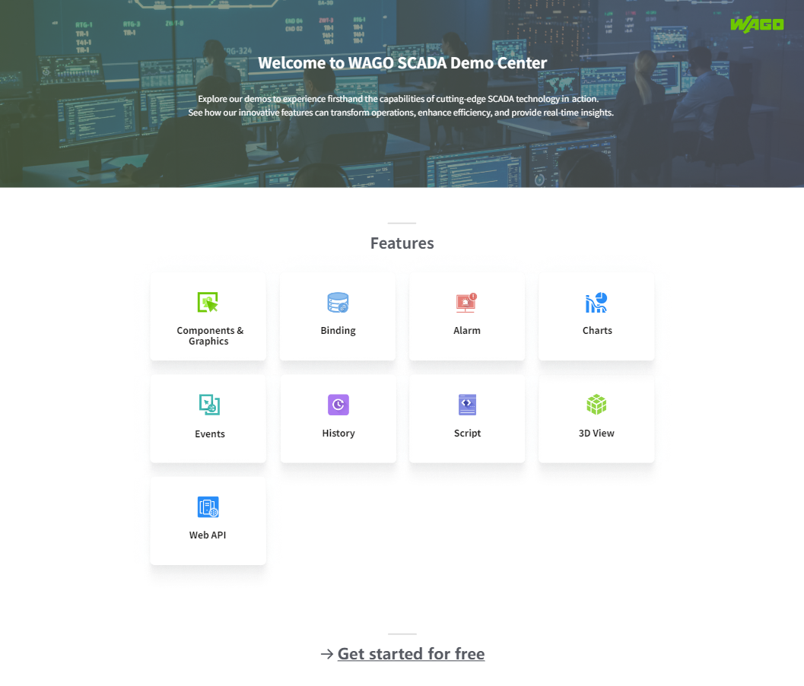

# Home

Description: This project is the entry project for all demos. The **Home** project provides a quick overview of the functionality of the core modules of WAGO SCADA.

In the project list, click on the Run button of the Home project to display the following page:

Click on each module under the "Features" section to open the corresponding page.

- **Components & Graphics:** When clicked, it displays the running page of the "Components" project. For more details, please refer to [Components](components.md)  .
- **Binding:** When clicked, it displays the property binding introduction page. This page is sourced from the "Features" project's Binding page. For more details, please refer to [Features](features.md)    .
- **Alarm:** When clicked, it displays the alarm introduction page. This page is sourced from the "Features" project's Alarm page. For more details, please refer to [Features](features.md)   .
- **Charts:** When clicked, it displays the charts introduction page. This page is sourced from the "Features" project's Charts page. For more details, please refer to [Features](features.md)   .
- **Events:** When clicked, it displays the events introduction page. This page is sourced from the "Features" project's Events page. For more details, please refer to [Features](features.md)    .
- **History:** When clicked, it displays the historical data introduction page. This page is sourced from the "Features" project's History page. For more details, please refer to [Features](features.md)  .
- **Script:** When clicked, it displays the script introduction page. This page is sourced from the "Features" project's Script Page. For more details, please refer to  [Features](features.md)   .
- **3D View:** When clicked, it displays the 3D introduction page. This page is sourced from the "Features" project's 3D View page. For more details, please refer to [Features](features.md)  .
- **Web API:** When clicked, it displays the Web API introduction page. This page is sourced from the "Features" project's Web API page. For more details, please refer to [Features](features.md)   .

**Click on "Get started for free" at the bottom to be redirected to the WAGO SCADA official website's "Download Software" page.**