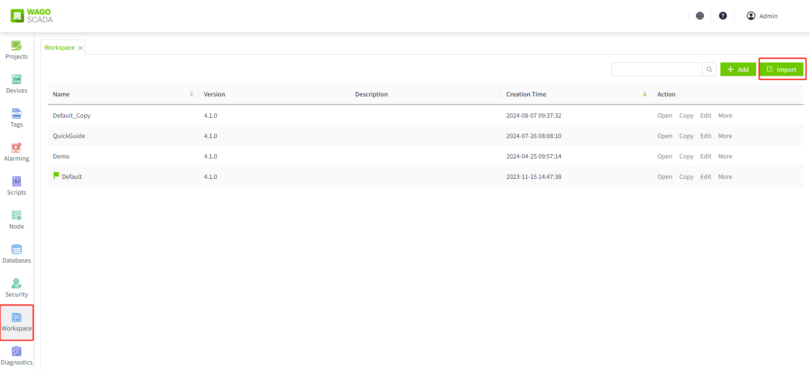
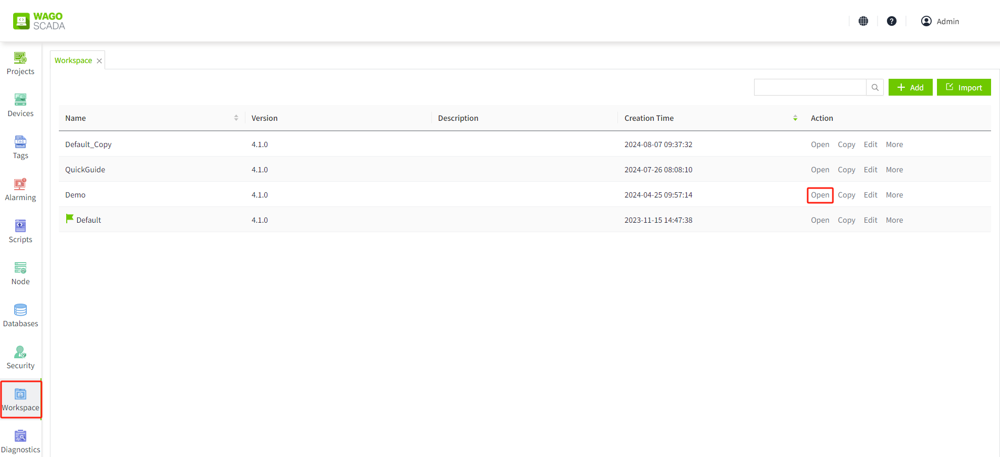
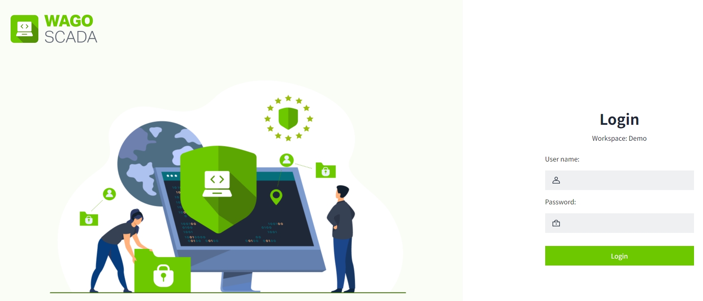
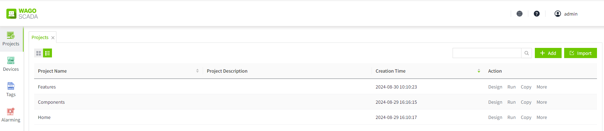

# Demo Workspace

The purpose of the demo workspace is to demonstrate the various functions, operating procedures and interface layouts of WAGO SCADA. Through the demo, users can understand and learn how to configure, monitor, and control the page, thereby making more efficient use of configuration software in practical applications.

#### **Download demo workspace**

 You can find it on our official website  [https://www.wagoscada.cn](https://www.wagoscada.cn), g o to the software download page and download the demo workspace .This demo is used to showcase the functionality of various controls in WAGO SCADA.

#### Import demo workspace to WAGO  SCADA

1. Install WAGO SCADA 
2. Extract the downloaded demo workspace file.
3. After extracting, go to the workspace list page, click the "**Import**" button, and import the Demo.wsbk file.

#### **View the Demo Workspace**

1. Click the "**Open**" button of the Demo workspace in the workspace list. 

It will go to the login page.

2. Refer to the extracted **Readme.txt** file for the initial **username** and **password** required to log in to the demo workspace.
3. Use the username and password from step 2 to log into the system.
4. On the project list page, click the run button for the project to view it. Detailed content can be found under [Home](home.md) ,[Components](components.md)   ,[Features](features.md)   .

