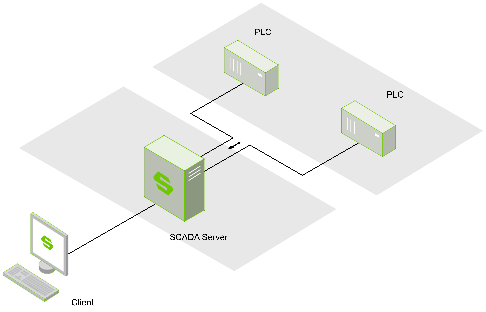

# Typical Architecture Selection Guide

## Single Server Architecture

| Required Authorized Modules | Quantity |
|:----------------------------|:---------|
| Platform                    | 1        |
| 2D Visualization            | 1        |

## Single Server Redundant Architecture

| Required Authorized Modules        | Quantity |
|:-----------------------------------|:---------|
| Platform (with redundancy)         | 1x2      |
| 2D Visualization (with redundancy) | 1x2      |

## Single Server + Database Architecture

| Required Authorized Modules | Quantity |
|:----------------------------|:---------|
| Platform                    | 1        |
| 2D Visualization            | 1        |
| Database Connection         | 1        |

## Basic Networking Architecture

| Required Authorized Modules  | Quantity |
|:-----------------------------|:---------|
| Line 1 - Platform            | 1        |
| Line 1 - Database Connection | 1        |
| Line 2 - Platform            | 1        |
| Line 2 - Database Connection | 1        |
| Plant - Platform             | 1        |
| Plant - 2D Visualization     | 1        |

## High Availability Networking Architecture

| Required Authorized Modules                       | Quantity |
|:--------------------------------------------------|:---------|
| Line 1 - Platform (with redundancy)               | 1x2      |
| Line 1 - Database Connection (with redundancy)    | 1x2      |
| Line 1 - 2D Visualization (with redundancy)       | 1x2      |
| Line 2 - Platform (with redundancy)               | 1x2      |
| Line 2 - Database Connection (with redundancy)    | 1x2      |
| Line 2 - 2D Visualization (with redundancy) | 1x2 | 1x2      |
| Line 2 - Database Connection (with redundancy)    | 1x2      |
| Plant - Platform (with redundancy)                | 1x2      |
| Plant - 2D Visualization (with redundancy)        | 1x2      |

## Cloud-Edge Networking Architecture

| Required Authorized Modules   | Quantity |
|:------------------------------|:---------|
| Site 1 - Platform             | 1        |
| Site 1  - Database Connection | 1        |
| Site 1  - 2D Visualization    | 1        |
| Site 2  - Platform            | 1        |
| Site 2  - Database Connection | 1        |
| Site 2  - 2D Visualization    | 1        |
| Cloud  - Platform             | 1        |
| Cloud - Database Connection   | 1        |
| Cloud  - 2D Visualization     | 1        |