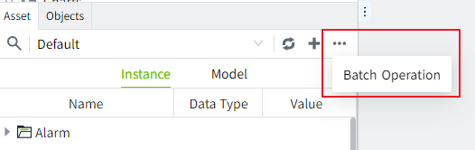
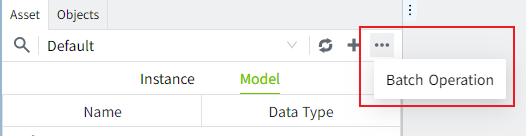
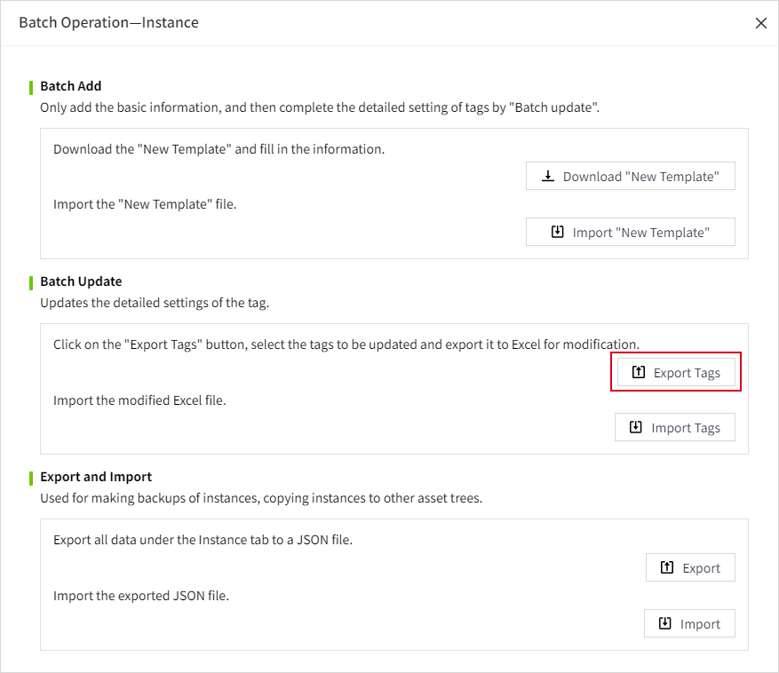
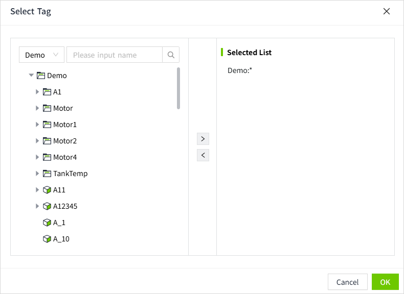
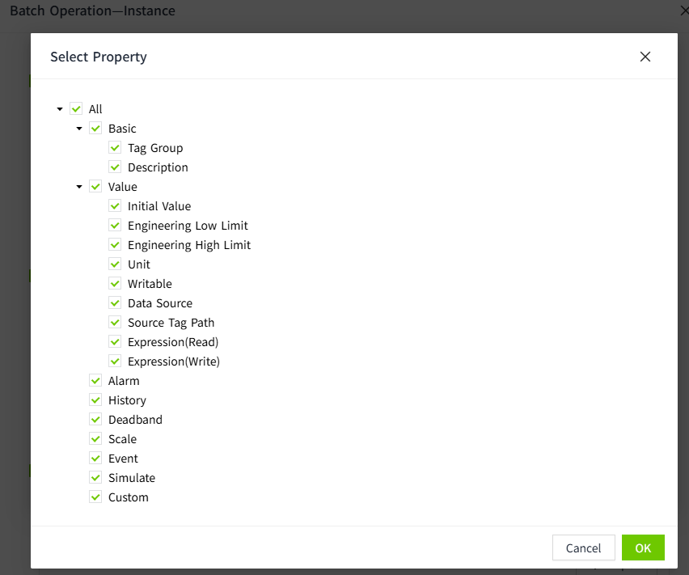
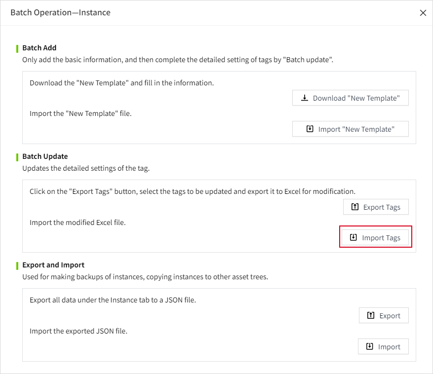

# Batch Update

After batch creating data on the **Model** or **Instance** page, you can update the detailed settings for the tags. This includes configurations such as alarm settings for tags and binding the data source paths for the tags.

## Export Tags

1. In the batch operation window of the **Model** or **Instance**, click the "Batch Operation" button.
    
    
2. In the batch operation popup, click the "Export Tags" button.
    
3. After clicking, a tag selector will pop up, allowing you to add the tags to be exported into the "Selected List". If a directory or instance is selected, it means that all tags under that directory or instance node (including the current node and all its child nodes) are selected. When a directory or instance is selected, an asterisk (*) is used to indicate all tags under it.
    
4. Click the "OK" button to open the property selection window, where you can choose the tag properties to be exported. The exported file will be in Excel format. Please refer to the [Tag Configuration Excel](tag.md).
    

## Import Tags

After modifying the exported tag file, click the "Import Tags" button in the batch operation pop-up to import the tags.

**Notes:**

- This operation will match the tags in the asset using the data in the path column of the Excel file, overriding the tag configurations. It does not support adding or deleting tags.
- For configurations that do not need to be updated, you can either delete the corresponding columns in the Excel file or set the values of the corresponding columns to empty.
- Tags referenced from the Type will have their modified configurations overwritten during the import tag configuration operation.

