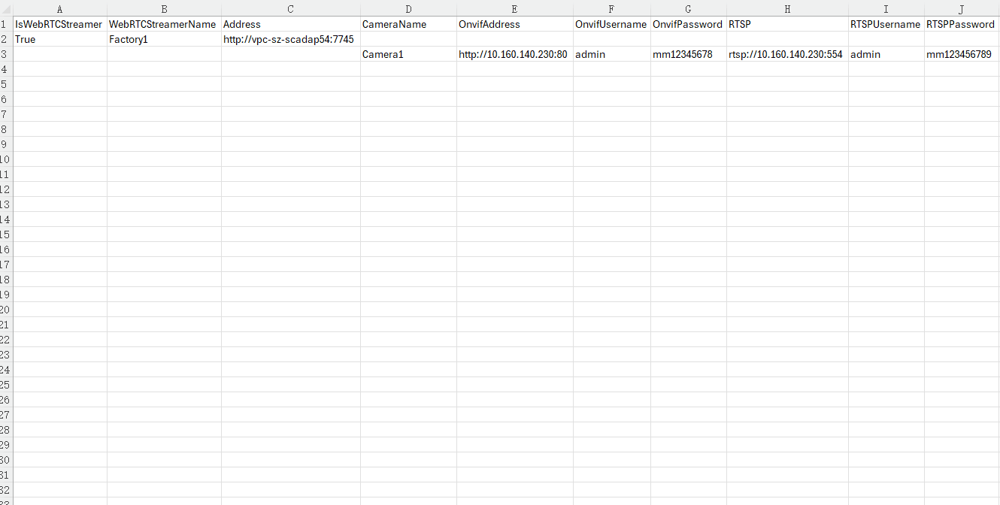

# Batch Operation of Camera Devices

In industrial settings, it is often necessary to create multiple devices in bulk. WAGO SCADA enables this through its export and import functions.

**Note:** To quickly create devices, it is recommended to first manually add a device to the list. Then, export the device and use the exported fields as a reference to add new devices.

#### Batch Addition

###### 1.Export Devices

Click the "Export" button in the upper right corner of the list to export all device information.

After clicking the Export button, you will be asked “Do you want to set a password for the exported file?”.

If you choose “Yes”, you need to set a password and then click “OK” button to export; if you choose “No”,  click “OK” button to export directly.

The export file is a zip file.

Double click the Camera.xlsx file under the zip file to view the exported device details.

**Example of an Exported File:**

- The content inside the red box represents the field information.
- If it is a WebRTCStreamer, the "IsWebRTCStreamer" field is set to **True**.
- Camera information is listed directly under the corresponding WebRTCStreamer. For example, in the image above, the WebRTCStreamer **"FactoryA"** has 1 camera, Camera1.

###### **2.Adding Devices in Excel**

Select the WebRTCStreamer and camera, then drag the mouse to quickly copy.

###### 3.Import Devices

Click the "Import" button in the upper right corner of the list to import the exported content. 

After uploading the file you want to import, if you set a password when exporting the file, you need to enter the password when importing the file before you can import it successfully. If no password is set when exporting, you can import the file directly by clicking the “OK” button after uploading it.

#### Batch Modification

You can batch modify device information through the exported Excel. After making changes in the Excel, import it back. During the import, the data will be updated based on the name.

- If the WebRTC Streamer name in the Excel matches the name in the Camera list, the data in the Excel for that entry will be used to update the data.
- If the WebRTC Streamer name and group in the Excel match the entries in the Camera list, the data in the Excel for that entry will also be used to update the data.
- If the WebRTC Streamer name or camera name in the Excel does not exist in the Camera list, the WebRTC Streamer and camera will be added to the list.
- If a WebRTC Streamer in the Camera list does not exist in the imported file, the data for that WebRTC Streamer will remain unaffected in the list.

#### Batch Deletion

After selecting the devices to be deleted, click the **Delete** button at the top of the list to perform batch deletion.

Notes:

- Only WebRTC Streamer on the current page can be deleted; cross-page deletion is not supported.
- When a WebRTC Streamer is deleted, its associated Cameras will also be deleted.