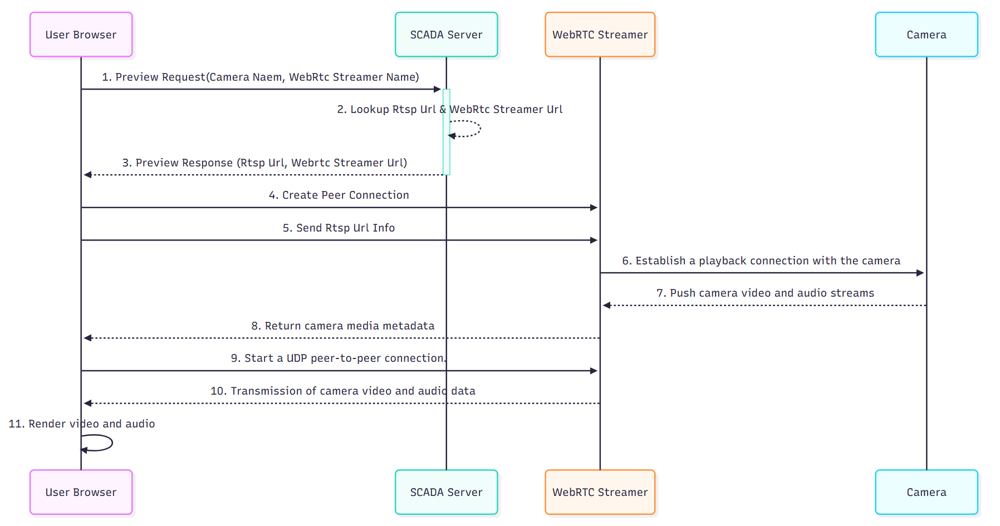
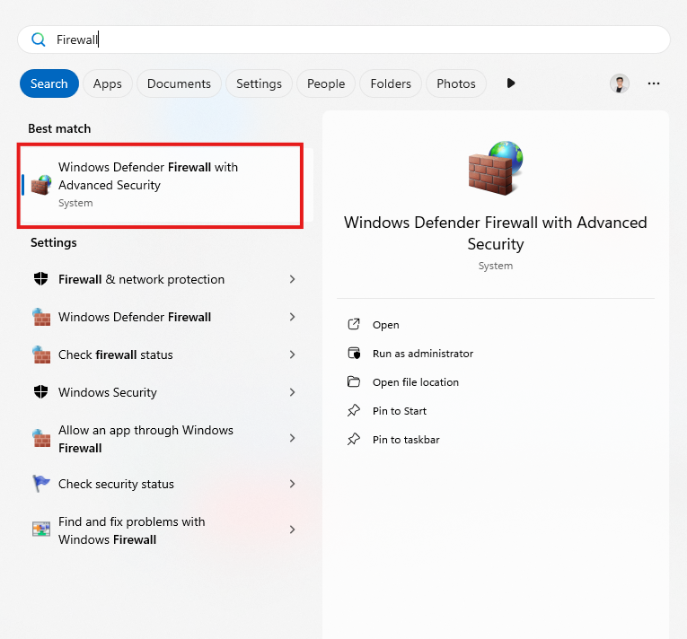
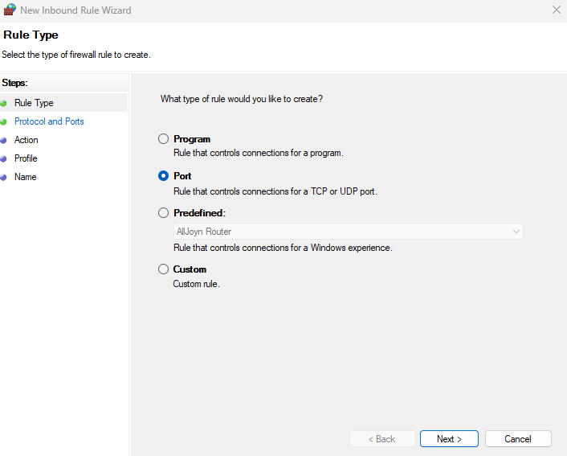
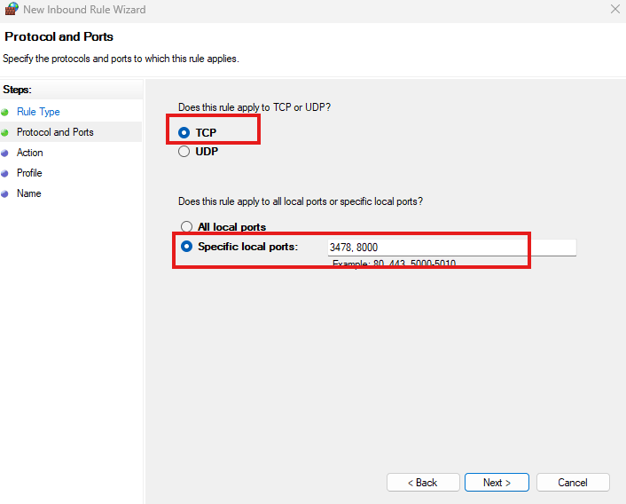
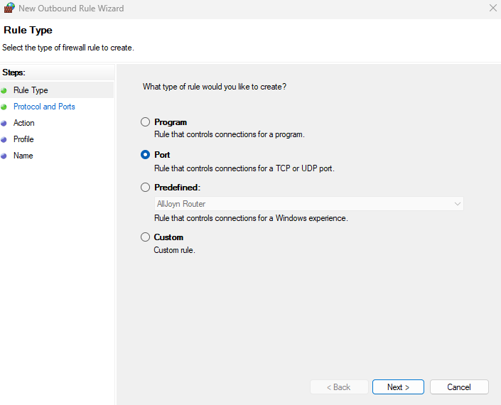
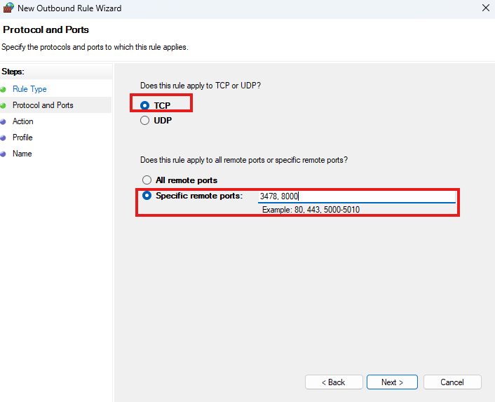
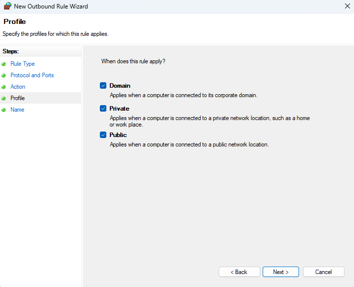
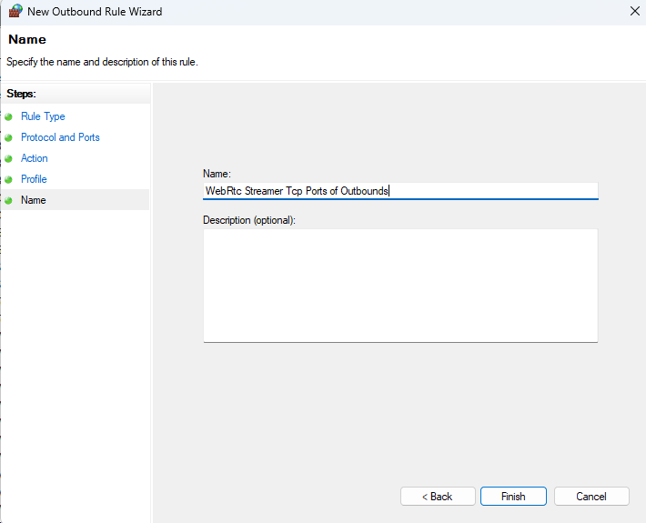

# Deploying the WebRTC Streamer Service

1. If the SCADA system is deployed in an public network environment. If a user needs to access a camera deployed in an internal network environment from an public network environment,  it is necessary to configure [Play Camera Video From External Network](play.md).
2. Additionally, the server hosting WebRtc Streamer should also be deployed on a server accessible from the public network.
3. And the TURN server information must be included during the startup of WebRtc Streamer.

#### UML Sequence Diagram



#### Deploy

##### Linux

###### **Download**

Download Address:  [Releases · mpromonet/webrtc-streamer](https://github.com/mpromonet/webrtc-streamer/releases) 

Below is the v0.8.10 download interface; the red box highlights the Linux version. Please choose the download that corresponds to your processor type. If you are unsure about your processor version, you can select the **Linux-armv7l-Release.tar.gz** version for download


###### **Deploying**

Extract the downloaded archive to your target directory.

```bash
# Enter the WebRTC-Streamer directory
cd /path/to/webrtc-streamer  

# Run the following command. -o use null codec (keep frame encoded)，This minimizes the server's performance impact.
./webrtc-streamer -H 0.0.0.0:8000 -o 

# If webrtc-streamer does not have execution permissions, you need to grant the necessary permissions first.
chmod +x webrtc-streamer

# Then run it.
./webrtc-streamer -H 0.0.0.0:8000 -o 
```
 
##### Windows

###### **Download**

Download Address:  [Releases · mpromonet/webrtc-streamer](https://github.com/mpromonet/webrtc-streamer/releases) 

Below is the v0.8.10 download interface; the Windows version is highlighted in the red box. Please click to download.


###### **Deploying**

Extract the downloaded archive to your target directory.

- **Method1**：Navigate to the extracted `bin` directory and double-click `webrtc-streamer.exe`. By default, WebRTC-Streamer runs on port **8000**.
- **Method2**：To start via the command line, navigate to the directory where `webrtc-streamer.exe` is located in the Windows Command Prompt (CMD) or PowerShell, and then execute:

```bash
webrtc-streamer.exe -H 0.0.0.0:8000 -o  
```
 
##### Docker

The following steps assume that Docker is already installed. If Docker is not installed, please refer to the official documentation.  [Install | Docker Docs](https://docs.docker.com/engine/install/)

###### **Use Image**

```bash
# -o use null codec (keep frame encoded)，This minimizes the server's performance impact.
docker run -p 8000:8000 -it mpromonet/webrtc-streamer -o
```
 
#### Troubleshooting playback issues

##### Firewall

After the service is deployed, the RTSP connection to the camera may still fail to play. In this case, you need to configure the appropriate port rules and open the startup ports for WebRTC Streamer, such as 8000 (startup TCP port), 3478 (built-in STUN server TCP and UDP ports), and 49152–65535 (UDP ports used for establishing WebRTC connections).
You should create inbound and outbound rules for **TCP** and **UDP** on ports **8000** (the startup port you specified for WebRTC Streamer) and **3478** (the built-in STUN server port).
Additionally, create inbound and outbound rules for** UDP** ports **49152–65535**.
Then, when starting WebRTC Streamer, append the corresponding parameters and command, for example: 

`webrtc-streamer.exe -H 0.0.0.0:8000 -S -R 49152:65535 -o`

###### **Turn on the firewall**




###### **Inbound Rules**

1. Inbounds => New Rule


2. Select Port and create the rule according to the options in the image below. 






3. Completed the creation of inbound rules for TCP ports 3478 and 8000.

4. Then repeat steps 1–3 to complete the creation of inbound rules for UDP ports 3478, 8000, and 49152–65535.


###### **Outbound Rules**

1. Outbound Rules => New Rule


2. Select Port and create the rule according to the options in the image below. 








3. Completed the creation of outbound rules for TCP ports 3478 and 8000.
4. Then repeat steps 1–3 to complete the creation of outbound rules for UDP ports 3478, 8000, and 49152–65535.


###### **Launch WebRtc Streamer.**

```bash
webrtc-streamer.exe -H 0.0.0.0:8000 -S -R 49152:65535 -o
# Explanation of parameters.
# -H 0.0.0.0:8000 State that WebRtc Streamer is accessed via port 8000.
# -S Start the internal STUN server (port 3478). If the -S parameter is not specified, the default STUN server will use Google's STUN server at stun.l.google.com:19302.
# -R 49152:65535 The range of UDP ports used when WebRtc creates a UDP connection.
# -o Do not use an encoder; use the original RTSP stream encoding. This parameter will reduce CPU usage and server load.
```