# License and Activation

The WAGO SCADA license is used for WAGO SCADA installation server activation. They need to be activated only once for the same installation instance and can be opened in several browser clients.

Both **online** and **offline** activation are supported

## Trial Mode

After installation WAGO SCADA can be used for a trial of all functions with a 2-hour countdown. After this time, the unauthorized modules will stop working and need to be reset, after which the trial can be continued for another 2 hours. There is no absolute time limit for the trial and the trial can continue after each reset. If all modules are purchased, the countdown will no longer be displayed. If only some of the modules were purchased, the countdown will also be displayed. If only the base platform module is purchased, the driver counting will not stop, the screen will no longer be forced to log out, and the other trial modules will still need to be reset every 2 hours.

| **Trial Module**          | **Trial behavior**  |
|:----------------------------|:--------------|
| Basic Platform Module      | Every 2 hours, stop pushing all data, stop reading and writing tags, all users are forced to log out, after logging in, you can click the "Reset Trial" button to continue the trial.                                                                       |
| 2D Visualization Module    | Stop front-end data push every 2 hours, preview and run page forcibly jump to "trial expired" prompt interface.                                                                                                                                             |
| 3D Visualization Module    | If "3D Viewer" control is used in the page, the data push of the whole screen will be stopped every 2 hours, and the preview and running page will be forced to jump to the "Trial expired" prompt interface.                                               |
| Database connection module | Database connection except built-in SQLite will not be affected, other types of database connection will be disconnected every 2 hours, modules that depend on database connection will no longer work, such as history storage, will no longer store data. |

## Trial Countdown

Once the WAGO SCADA backend service is started, the trial countdown begins immediately.

All trial modules share a unified countdown timer. Each trial session lasts **2 hours**, and the trial can be reset after each session.

If no modules have been purchased, the trial countdown is displayed.

If at least one module has been purchased, the trial expiration message will no longer be shown on the page.

## Trial Expired

If the user uses modules that have not been purchased, once the trial period expires, both the **Preview** and **Runtime** pages will be forcibly redirected to a **"Trial Expired"** notification page.

This page will display the **expired trial modules** and provide instructions on how to **reset the trial**.

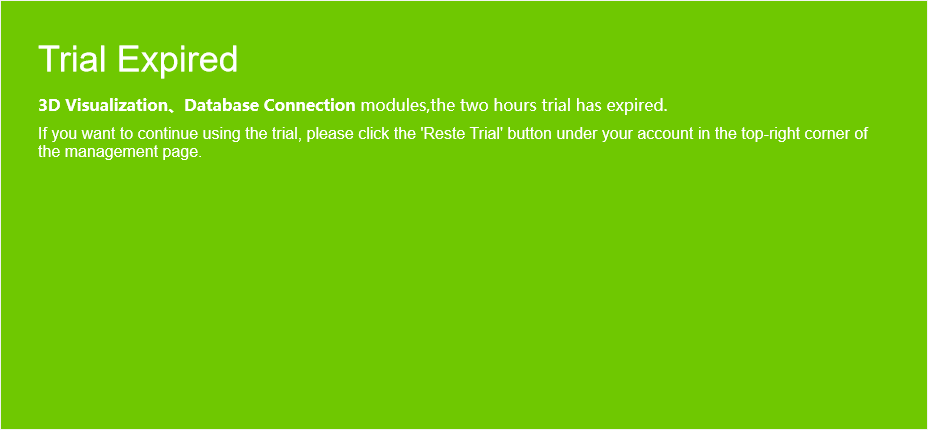

## Reset Trial

If the user has not purchased any modules, a **"Trial Expired"** popup will appear on both the management page and designer pages when the trial period ends.

By clicking the **"Reset Trial"** button in the popup or the **"Reset Trial"** button under the user account, the user can start a new trial session.

After the trial expires, a red dot will appear on the top-right corner of the account to indicate the expiration.

Click on the "Reset Trial" button to bring up the Reset Trial window, click the "OK" button to complete the reset.

If the user has purchased some modules, the "Trial Expired" popup will not appear on the Management Page or Designer pages when the trial ends.

However, the user can still manually click the "Reset Trial" button under the account to start a new trial session.

After the trial expires, a red dot will appear on the top-right corner of the account to indicate the expiration.

Click on the "Reset Trial" button to bring up the Reset Trial window, click the **"OK"** button to complete the reset.

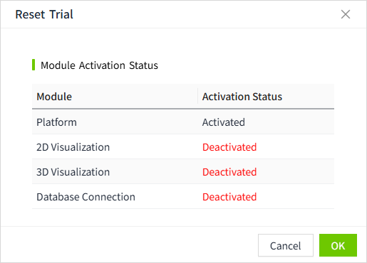

## Activation

###### **Online Activation Example**

If your installation server is connected to an extranet and has access to the WAGO SCADA license service site, you can choose online activation. After activation, the key is bound to the installation server and the same key cannot be activated on more than one server.

To activate, click on "Activate License":

1. Click "Node"->"License", and click on the "Activate License" button.

2. Fill in the key, read the agreement and click the "Activate Online" button.
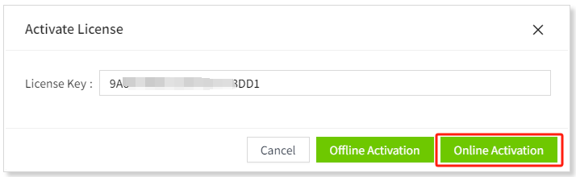
3. After successful activation, the license list will show the license information. For activated keys, you can perform deactivate and refresh operation.

###### **Offline Activation Example**

If your installation server is not connected to an external network, you can follow the steps below to activate it offline.

Activation Steps:

1. Click on the "Offline Activation" button.

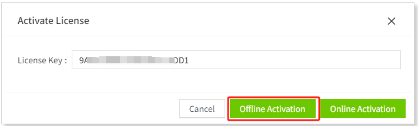

2. Click the "Generate Activation Request" button to automatically generate and display the activation request content. Please save the activation request. 

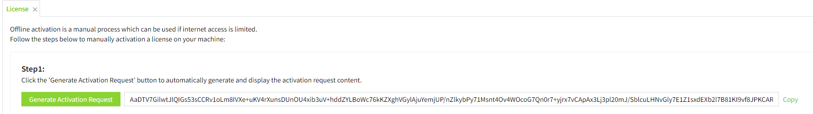

3. Transfer the generated activation request content to a machine with network access. Visit the following address and enter the request content. After confirmation, the license is automatically generated.

4. Go back to the offline activation page, paste in the license, and click the "Activate Button" to complete the offline activation.

## Deactivation

When you need to change the server, you need to do the deactivation operation first, the same key only has three deactivation opportunities, after the number of times used up will not support the deactivation, do not use the deactivation function unless necessary.

###### **Online Deactivation Example**

If your installation server is connected to an external network and has access to the WAGO SCADA license service site, you can choose online deactivation.

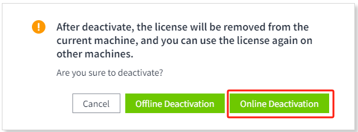

###### **Offline Deactivation Example**

If your installation server is not connected to an external network, you can follow the steps below to perform offline deactivation.

Please note that offline deactivation does not check the remaining deactivation count, but only when you submit the offline deactivation request to the server. Therefore, it may happen that the offline request is generated successfully, but it fails to submit the offline request content because the offline request count is exhausted. Don't worry, you can use the same key to activate it on the original server and resume normal use.

1. Click on the "Offline Deactivation" button.

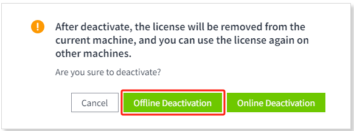

2. Clicking on the "Generate Deactivation Request" button will automatically generate and display the content of the deactivation request. After clicking this button, the license will be deleted from the current machine. Please save the content of the deactivation request.

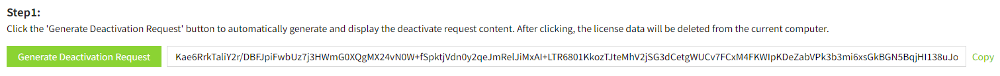

3. Transfer the generated deactivation request to a machine with network access. Visit the WAGO SCADA License Service site, enter the content of the inactivation request into the inactivation input box and click on the confirmation button.

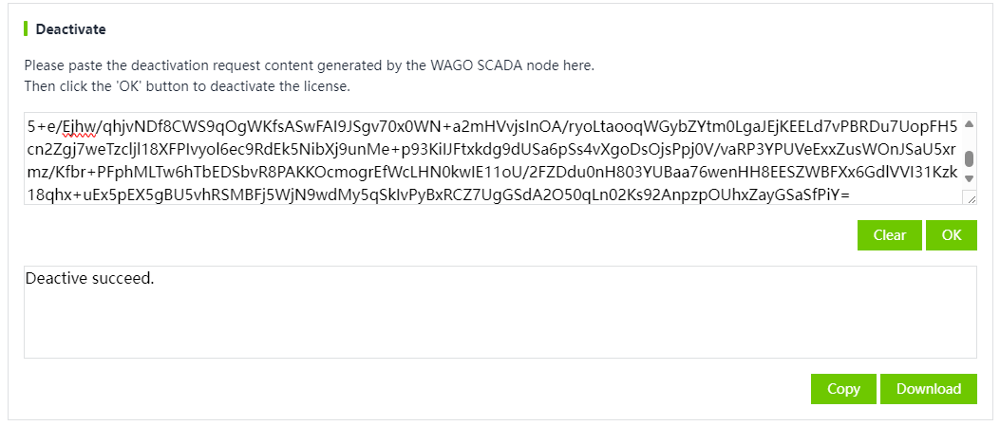

## Refresh

If you have renewed your warranty or purchased a new module, you can refresh your license to obtain and update the latest license information.

###### **Online Refresh Example**

If your installation server is connected to an extranet and has access to the WAGO SCADA License Service site, you can choose to refresh your license online.

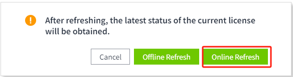

###### **Offline Refresh Example**

If your installation server is not connected to an external network, you can follow the steps below to refresh offline.

1. Click the "Offline Refresh" button.

2. Click the "Generate Refresh Request" button to automatically generate and display the content of the refresh request. Please save the content of the refresh request.

3. Transfer the content of the generated refresh request to a machine with network access. Access the WAGO SCADA License Service site and enter the content of the request. After confirmation, a new license is automatically generated. Copy the license and transfer it to the server to be refreshed.

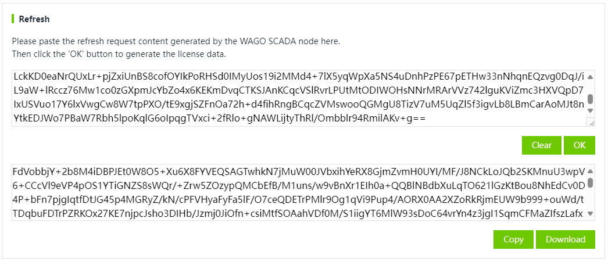

4. Go back to the offline refresh page, paste and input the new license, and click "Refresh" button to complete the offline refresh operation.

## Emergency Activation 

If the server on which WAGO SCADA is installed is not working properly due to hardware damage or an abnormal system environment, and you cannot reactivate the license, you can use the same activation code on a new machine to perform emergency activation, using the same activation method as described above for online or offline activation. The emergency activation is the same as the above online or offline activation method. The emergency activated license is only valid for 7 days and will enter trial mode after 7 days. During the 7 days, you can try to repair the damaged server, if you really can't repair it, you can contact the after-sales personnel to respond to the situation for further processing.

It is recommended to make a good backup of the project configuration data, so that when you need to activate the use of emergency without reconfiguration, import the backup of the project data can be.

Each license code has only one chance to use emergency activation. If there are no special circumstances, please do not try to activate the same license code on multiple machines to prevent wasting an emergency activation opportunity.

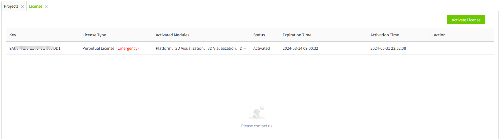

##  Renewal 

If you need to renew an authorization code, after completing the renewal order, the relevant after-sales personnel will renew the original authorization code, and you only need to refresh the license.

##  Add Module 

If you need to buy a new module, after completing the order of adding modules, the relevant after-sales personnel will renew the original authorization code, you only need to refresh the license.

