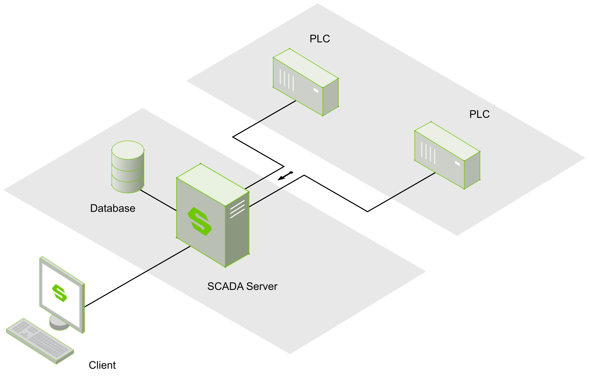

# Standalone Deployment

 Standalone deployment is the most fundamental method of deploying WAGO SCADA. The configuration for a standalone deployment is very simple, and other more complex deployment methods are based on this basic approach.

 In a standalone deployment, WAGO SCADA is installed on a single server. This WAGO SCADA node can connect to multiple PLCs, OPC UA servers, and databases. The SCADA system in standalone deployment can use the built-in SQLite database to store historical data, or it can connect to other database servers and store historical data within them. Additionally, this server allows any number of clients to access it remotely.

## **Multi-network Support**

  WAGO SCADA supports multi-NIC (Network Interface Card) servers and can act as a bridge between multiple networks or communicate with multiple sites via an enterprise-widearea network. Since clients communicate with the databases and programmable logic controllers (PLCs) through WAGO SCADA, they can launch from both the enterprise network and the isolated control network, providing full access to both. The built-in security settings can restrict access to certain parts of the project or deny access to the entire project based on user roles and network locations, limiting project access to users on different networks.

 
 

